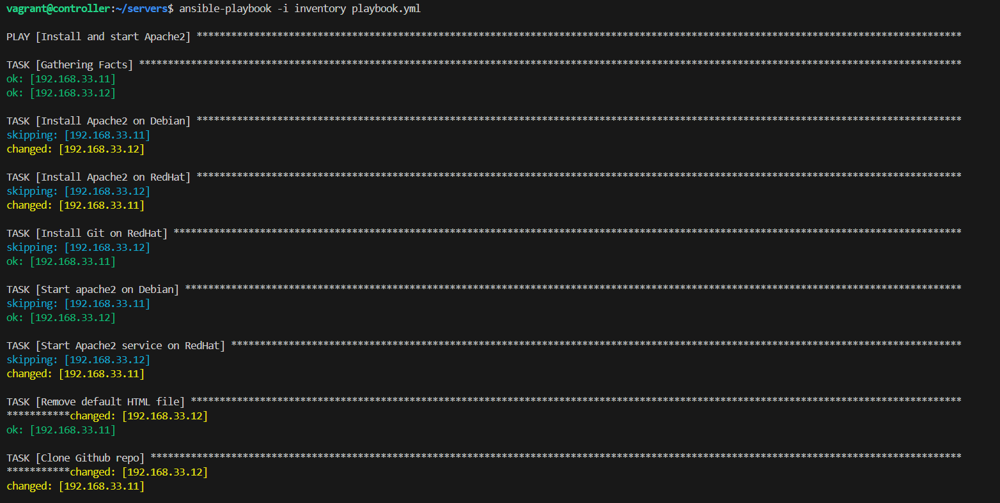
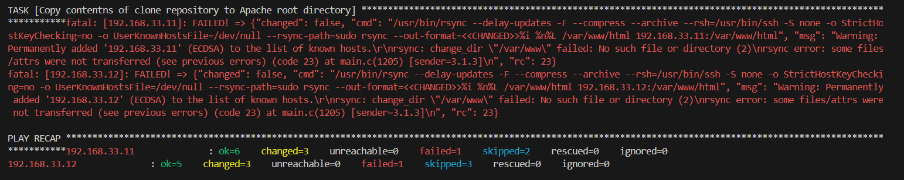

# Ansible Playbook to Install Apache2, Start Apache2 and Upload a cloned Github repo webpage

### Content of the Playbook

    ---
    - name: Install and start Apache2
    hosts: all
    become: true
    tasks:
        - name: Install Apache2 on Debian
        apt:
            name: apache2
            state: present
        when: ansible_os_family == "Debian"

        - name: Install Apache2 on RedHat
        yum:
            name: httpd
            state: present
        when: ansible_os_family == "RedHat"

        - name: Install Git on RedHat
        package:
            name: git
            state: present
        when: ansible_os_family == "RedHat"

        - name: Start apache2 on Debian
        service:
            name: apache2
            state: started
        when: ansible_os_family == "Debian"

        - name: Start Apache2 service on RedHat
        service:
            name: httpd
            state: started
        when: ansible_os_family == "RedHat"

        - name: Remove default HTML file
        file:
            path: /var/www/html/index.html
            state: absent

        - name: Clone Github repo
        git:
            repo: https://github.com/Vctcode/WebPage-AltSchool.git
            dest: /var/www/html

        - name: Copy contents of clone repository to Apache root directory
        synchronize:
            src: /var/www/html
            dest: /var/www/html

#### Screenshot of Ansible run

#### Sreenshot of Cloned Github repo hosted by Apache server running on the Browser

##### Ansible Node running on port: 2202

.png>)

##### Ansible Node running on port: 2201

.png>)
